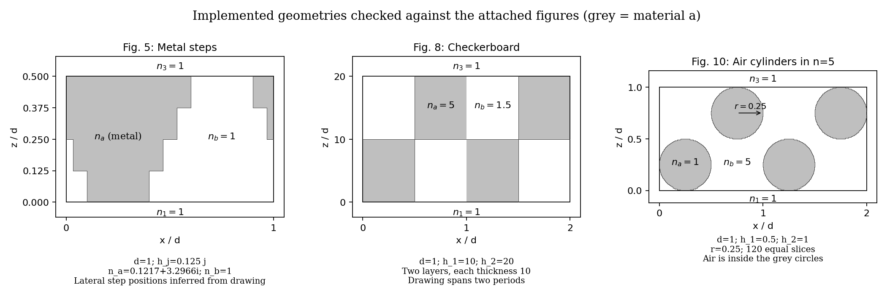

# 添付の図5・8・10との設定照合

2026-10-07（JST）、追加添付の3図と、`geometries.py`、ソルバーに渡す外部媒質・
入射条件、保存済み4図のmetadataを照合しました。**キャプションに指定された値に
ずれはありません。数値設定の修正とスペクトル再計算は不要です。**

| 添付図 | 指定値と現在の実装 | 照合結果 |
|---|---|---|
| 図5 | `d=1`、`h_j=0.125j`、`n_a=0.1217+3.2966i`、`n_b=1`、`n1=n3=1` | 一致。4層の厚さはそれぞれ0.125、全厚0.5。 |
| 図8 | `d=1`、`h1=10`、`h2=20`、`n_a=5`、`n_b=1.5`、`n1=n3=1` | 一致。各層の厚さは10、全厚20。下層の`[0,0.5d]`がa、上層は交替。 |
| 図10 | `d=1`、`h1=0.5`、`h2=1`、`r=0.25`、`n_a=1`、`n_b=5`、`n1=n3=1` | 一致。円内部がa、背景がb、全厚1。半径0.25、直径0.5。 |

図8・10の図示範囲は`0..2d`ですが、繰り返し周期は`d=1`です。
図10では1周期あたり円中心を`(x,z)=(0.25,0.25),(0.75,0.75)`とし、
周期的に繰り返しています。下側のn1から上側のn3へ入射する層順です。
材料の屈折率nを`epsilon=n²`へ変換してソルバーに渡すことも確認しました。

図5の**横方向の段差位置には数値の寸法指定がありません**。現在は図から推定した
金属中心`x/d=0.25`、下からの金属幅`[0.3,13/30,17/30,0.7]`を維持しています。
正規化した金属区間は、下から`[0.1,0.4]`、`[1/30,7/15]`、
周期的な`[-1/30,8/15]`、`[-0.1,0.6]`です。これらはキャプションに記載された
確定値ではありません。今回の添付にも追加寸法はないため、推定値を置き換えていません。

以下は、実際にソルバーへ渡す層データから描いた形状です。灰色は材料aです。
図10は120スライスの階段近似をそのまま表示しています。

実装と保存済みmetadataの全層の厚さ・周期・物理遷移位置・誘電率も一致しました。
照合記録と添付画像のhashは`diagnostics/attached_geometry_audit.json`に保存しています。

今回の設定一致の確認は、図11の論文曲線との差を解消したことを意味しません。
既存の[スペクトル精度評価](ASSESSMENT_ja.md)は引き続き有効です。
