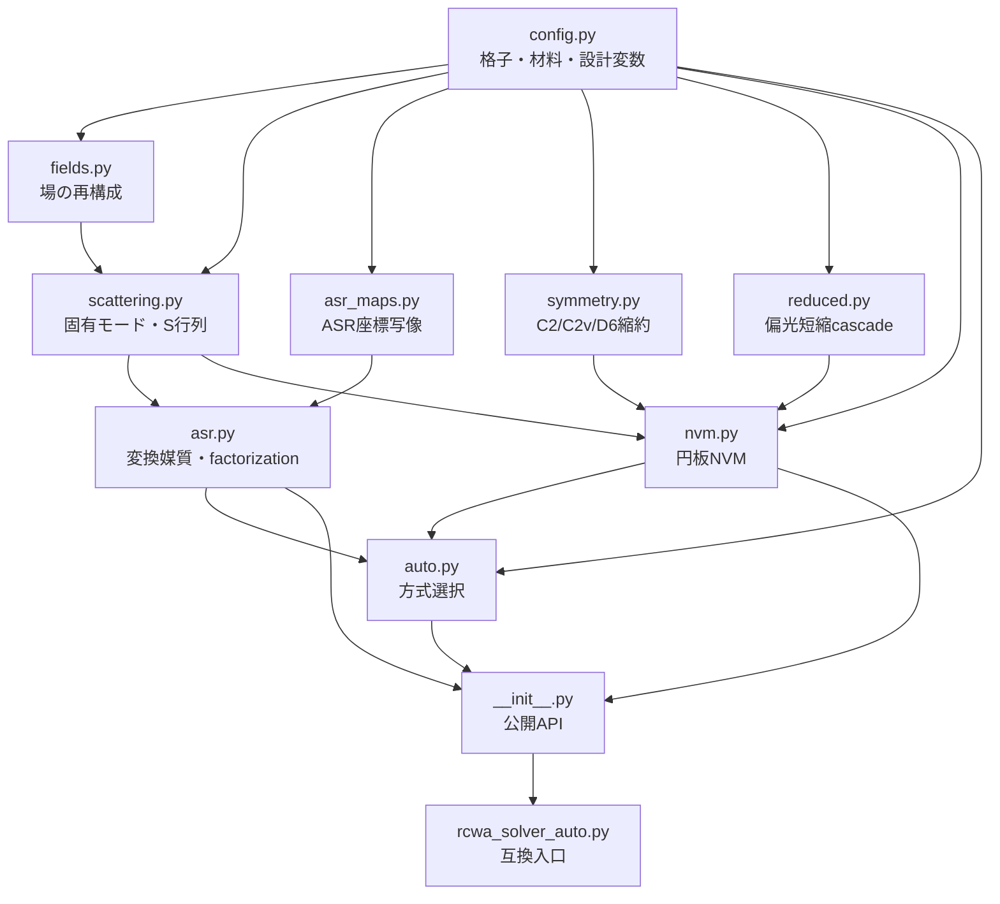

# modular RCWA 実装：ファイル構成と数式導出

## 1. 分割が必要だった理由

旧 `rcwa_solver_auto.py` は約 5,600 行あり、次の独立した変更理由を一つのファイルに
抱えていた。

1. 格子・材料・設計変数 API の変更
2. Maxwell 固有値問題、S 行列、場再構成の変更
3. ASR/matched-coordinate 写像と Fourier factorization の変更
4. 円板 NVM と Bessel 係数の変更
5. C2/C2v/D6 群論と偏光セクターの変更
6. Redheffer/Li-2a 短縮 cascade の変更
7. 自動方式選択の変更

これらは検証方法も異なるため、一つの保守単位に置くと、ASR の修正が NVM の import
や公開 API に影響しやすくなる。分割後は、公開互換入口を除いて、責務ごとに次の
依存関係とした。



import は上から下への一方向であり、循環 import はない。旧コードの

```python
from rcwa_solver_auto import AutoRCWA, Circle, LayerSpec
```

は互換入口から同じ公開オブジェクトを取得する。新規コードでは

```python
from rcwa_ext import AutoRCWA, Circle, LayerSpec
```

を推奨する。

---

## 2. `rcwa_ext/config.py`：格子、材料、設計変数

### 2.1 責務

- `Lattice`, `Material`, `Circle`, `Rectangle`, `LayerSpec`
- `ASROptions`, `NVMOptions`, `GroupTheoryOptions`, `OutputSpec`
- method/cascade/polarization 名の正規化
- trainable scalar Tensor と検証用 scalar の分離

このファイルは solver 行列を作らず、問題定義と不変条件だけを扱う。

### 2.2 直接格子と逆格子

斜交格子の直接基底を

\[
\mathbf a_1=(L_1,0),\qquad
\mathbf a_2=(L_2\cos\zeta,L_2\sin\zeta)
\]

とする。単位胞面積は

\[
A=|\mathbf a_1\times\mathbf a_2|=L_1L_2\sin\zeta
\]

である。逆基底は

\[
\mathbf a_i\cdot\mathbf b_j=2\pi\delta_{ij}
\]

より

\[
\mathbf b_1=2\pi\left(\frac1{L_1},
-\frac{\cos\zeta}{L_1\sin\zeta}\right),\qquad
\mathbf b_2=2\pi\left(0,\frac1{L_2\sin\zeta}\right)
\]

となる。`square` は (L_1=L_2,\zeta=90^\circ)、`triangular` は
(L_1=L_2,\zeta=60^\circ) である。

### 2.3 設計 Tensor

半径または層厚を (p) とすると、実装は

\[
p_t=\operatorname{to\_real\_tensor}(p),\qquad
p_c=\operatorname{item}(\operatorname{detach}(p_t))
\]

を作る。(p_c) は有限性・正値性・幾何適格性の `if` 判定だけに使い、物理式は
必ず (p_t) を使う。したがって

\[
\frac{\partial F}{\partial p_t}
\]

が維持される。`Circle.__post_init__` も radius Tensor を `float` へ置換しない。

### 2.4 このファイルを変更するときの検証

- dataclass の入力互換性
- dtype/device 変換後も元 leaf Tensor へ勾配が戻ること
- 格子種別判定と primitive vector
- trainable radius の Tensor identity

---

## 3. `rcwa_ext/fields.py`：Fourier 場の再構成

### 3.1 責務

- 内部層・入出力半空間の Fourier amplitude
- (E_z,H_z) の回復
- `field_xy`, `field_xz`, `field_yz`
- 物理層番号と (z) 位置の対応

場の可視化は固有値問題の生成とは独立なので、S 行列基盤から分離した。

### 3.2 横場の modal 展開

層 (l) の電気・磁気固有ベクトルを (W_l,V_l)、伝搬定数を
(\Lambda_l=\operatorname{diag}(k_{z,n})) とする。横場は

\[
\mathbf e_t(z)=W_l\left[X_l(z)\mathbf c_l^+
+X_l(d_l-z)\mathbf c_l^-\right],
\]

\[
\mathbf h_t(z)=V_l\left[X_l(z)\mathbf c_l^+
-X_l(d_l-z)\mathbf c_l^-\right]
\]

と再構成できる。ここで torcwa の位相規約に合わせて

\[
X_l(z)=\exp(i\omega\Lambda_l z)
\]

である。`Cf/Cb` または global coupling から
(\mathbf c_l^+,\mathbf c_l^-) を得る。

群論短縮ではmode数を \(D_r\) とし、`C[direction][layer]` は外部矩形sourceから
\([\mathbf c_l^+(0);\mathbf c_l^-(d_l)]\in\mathbb C^{2D_r}\) への写像として保存する。
入力境界stateを各層のleft modal basisで解き、right boundaryへ伝搬する操作を前方・後方
sourceについて行う。partial公開Sでも場を要求した場合は、両方向full field Sを別保存する。

### 3.3 縦場と空間合成

Maxwell 方程式の (z) 成分から、概念的には

\[
E_z=\epsilon_{zz}^{-1}(K_yH_x-K_xH_y),\qquad
H_z=\mu_{zz}^{-1}(K_xE_y-K_yE_x)
\]

を使う。ASR 層では transformed basis の縦場を `Tz` で Cartesian Fourier basis へ戻す。
最後に

\[
F(x,y,z)=\sum_{m,n}F_{mn}(z)
\exp\{i[k_{x,m}x+k_{y,n}y]\}
\]

を評価する。場を要求しない計算では `fields="none"` とし、これらの coupling 保存を
省略できる。
`fields="external"`、`"internal"`、`"all"` はそれぞれ入出力半空間だけ、構造層内だけ、
両方の場APIを有効にする。領域指定は単なる保存ヒントではなく、`fields.py` が呼出時にも
検査するため、指定外の場を誤って利用しない。
`OutputSpec.smatrix=False` では場用のfull Sとcouplingだけを非公開で残し、公開Sを全ゼロに
maskする。`S_parameters()` はこのfields-only状態を検出して例外を返す。
群論短縮時はsourceの部分空間残差
\(\|E_i-B_EB_E^\dagger E_i\|/\|E_i\|\) も検査し、未計算sectorを含むsourceから
不完全な場を合成しない。
三角D6-starでは \(E_z,H_z\) の `epsilon_zz`／`mu_zz` inverse ruleもscalar star内で
解き、その後scalar embeddingで矩形Fourier配列へ戻す。矩形boxで逆行列を計算してから
starへ切り出す方法はcorner harmonicを再混入させるため使用しない。
ASRの縦変換も同様に

\[
T_{z,\star}=E_s^\dagger T_zE_s,\qquad
E_z^{\Box}=E_sT_{z,\star}\epsilon_{zz,\star}^{-1}E_s^\dagger b_E
\]

の順で行う。full-boxの \(T_z\) をstar場へ後掛けしてcorner harmonicを再生成しない。
横場は固有値問題で既にstarへ制限したCartesian modeを直接使用する。

---

## 4. `rcwa_ext/scattering.py`：共通 Maxwell 固有値問題と S 行列

### 4.1 責務

- 標準 torcwa 層と modal basis
- 安定な linear solve/eigensolve
- 層 S 行列
- Redheffer star product
- Li algorithm 2a
- full/half/quarter 出力

### 4.2 一階 Maxwell 系から固有値問題へ

Fourier 展開後の横場を

\[
\mathbf e=(E_x,E_y)^T,\qquad
\mathbf h=(H_x,H_y)^T
\]

とまとめると、各一様 (z) 層では

\[
\frac{d\mathbf e}{dz}=i\omega P\mathbf h,
\qquad
\frac{d\mathbf h}{dz}=i\omega Q\mathbf e
\]

と書ける。第一式をもう一度微分すると

\[
\frac{d^2\mathbf e}{dz^2}=-\omega^2PQ\mathbf e
\]

である。従って

\[
PQW=W\Lambda^2
\]

を解き、放射・減衰方向に対応する枝

\[
\operatorname{Im}k_z\ge0,qquad
\operatorname{Im}k_z=0\text{ なら }\operatorname{Re}k_z\ge0
\]

を選ぶ。磁気 modal matrix は規約に応じて

\[
V=QW\Lambda^{-1}
\]

に相当する形で作る。数値 solve は逆行列を明示せず
`torch.linalg.solve` を complex128 で行い、結果だけ要求 dtype へ戻す。

### 4.3 層厚と伝搬

厚さ (d_l) の伝搬行列は

\[
X_l=\operatorname{diag}\exp(i\omega k_{z,n}d_l)
\]

であり、層厚勾配は

\[
\frac{\partial X_l}{\partial d_l}
=\operatorname{diag}(i\omega k_{z,n})X_l
\]

となる。`thickness` は `config.py` の実 Tensor のままここへ届く。

### 4.4 層 S 行列

参照媒質の magnetic basis を (V_0)、層 basis を (W,V) とすると

\[
A=W+V_0^{-1}V,\qquad B=W-V_0^{-1}V
\]

を使って interface coupling を作る。場再構成が不要なら、(4N\times4N) coupling を
保存せず、(A,B,X) から Eq.-29 型の散乱ブロックを直接計算する。

torcwa のブロック順は

\[
S=[T_f,R_f,R_b,T_b]
\]

である。`half` は ([T_f,R_f])、`quarter` は (R_f) だけを保持する。

### 4.5 Redheffer 再帰

右側の既合成反射を (R)、左要素を
((T_f,R_f,R_b,T_b)) とすると、左から prepend した反射は

\[
R_{\rm new}=R_f+T_b(I-RR_b)^{-1}RT_f
\]

である。forward transmission は

\[
T_{\rm new}=T(I-R_bR)^{-1}T_f
\]

となる。quarter では (T) の再帰自体を作らない。

### 4.6 Li algorithm 2a

隣接 modal basis の変換行列を

\[
\mathcal T=B_{r}^{-1}B_l
=\begin{bmatrix}t_{11}&t_{12}\\t_{21}&t_{22}\end{bmatrix}
\]

とし、安定な減衰位相 (X) と既合成反射 (R) から

\[
\Omega=XRX,\qquad D=t_{22}+t_{21}\Omega
\]

を作る。右反射更新は

\[
R_b^{\rm new}=(t_{12}+t_{11}\Omega)D^{-1}
\]

に対応する right solve で実装する。Redheffer と独立な経路なので、両者の一致が
強い回帰試験になる。

---

## 5. `rcwa_ext/asr_maps.py`：ASR と matched-coordinate 写像

### 5.1 責務

- 長方形用 separable (x(u),y(v))
- 直方格子円の Weiss 型 matched map
- 三角格子円の D6-equivariant map
- 写像 Jacobian と orientation 検査

写像生成だけを物性 Fourier 行列から分離したため、幾何写像の単体検証ができる。

### 5.2 一次元 ASR 写像

物理区間幅を (\Delta x_l) とし、計算座標幅を

\[
\Delta u_l=L\frac{(\Delta x_l)^{1/3}}
{\sum_j(\Delta x_j)^{1/3}}
\]

と配分する。区間 ([u_l,u_{l+1}]) で

\[
x(u)=a_1+a_2u+\frac{a_3}{2\pi}
\sin\frac{2\pi(u-u_l)}{\Delta u_l},
\]

\[
\frac{dx}{du}=a_2+\frac{a_3}{\Delta u_l}
\cos\frac{2\pi(u-u_l)}{\Delta u_l}
\]

とする。係数は

\[
a_2=\frac{\Delta x_l}{\Delta u_l},\qquad
a_3=G\Delta u_l-\Delta x_l
\]

であり、境界近傍の最小 slope を (G) で制御する。

### 5.3 直方格子の円 matched map

円中心を ((x_c,y_c))、半径を (R) とし、

\[
x_\pm(y)=x_c\pm\sqrt{R^2-(y-y_c)^2}
\]

を円境界の左右枝とする。計算座標の中央区間をこれらの曲線へ線形補間し、外側区間を
周期端点へ接続する。x/y を対称に構成することで、円の各 quadrant を座標面へ一致させる。
breakpoint は (R/\sqrt2) に依存するため、Tensor の `stack` で作り、半径勾配を保つ。

### 5.4 三角格子の D6 matched map

cell 中心から最近接周期像への斜交座標を (mathbf q=(q_1,q_2)) とする。六角形 support を

\[
h(\mathbf q)=\max\left(
|q_1+q_2/2|,
|q_1/2+q_2|,
|q_1-q_2|/2
\right)
\]

と定義すると、(h=L/2) は Wigner--Seitz 境界で D6 不変である。

\[
\rho=\frac{h(\mathbf q)}R,\qquad
\mathbf q_I=\frac{\mathbf q}{\rho}
\]

とし、(
ho=1) の computational hexagon を物理円へ送る scale を

\[
c(\hat{\mathbf q})=rac{R}{\|\mathbf q_I\|}
\]

とする。内側、円境界、Wigner--Seitz 境界を cubic Hermite 補間し、

\[
\mathbf q'=s(\rho,\hat{\mathbf q})\mathbf q_I
\]

を得る。条件は

\[
s(0)=0,\quad s(1)=c,\quad s'(1)=G,
\quad s(\rho_{\rm out})=\rho_{\rm out},\quad
s'(\rho_{\rm out})=1
\]

である。最後の二条件により周期境界で値と一階微分が identity map に接続する。

Jacobian 成分

\[
x_u,x_v,y_u,y_v,\qquad
\det J=x_uy_v-x_vy_u
\]

は autograd で生成する。trainable radius では `create_graph=True` とし、
(\partial_R\partial_u x) などを保持する。必ず (\det J>0) を検査する。

---

## 6. `rcwa_ext/asr.py`：変換媒質、factorization、ASR 層

### 6.1 責務

- coordinate-transformed (\epsilon,\mu)
- Li/Wang 型 Fourier factorization
- ASR basis と Cartesian basis の変換 (T,T_z)
- 長方形および円 matched-ASR 層の (P,Q)

### 6.2 変換媒質

写像

\[
J=\frac{\partial(x,y)}{\partial(u,v)}
=\begin{bmatrix}x_u&x_v\\y_u&y_v\end{bmatrix},
\qquad h=\det J
\]

に対し、等方媒質の transformed transverse tensor は

\[
\epsilon_t'=\epsilon hJ^{-1}J^{-T}
=\epsilon
\begin{bmatrix}
(x_v^2+y_v^2)/h&-(x_ux_v+y_uy_v)/h\\
-(x_ux_v+y_uy_v)/h&(x_u^2+y_u^2)/h
\end{bmatrix},
\]

\[
\epsilon_{33}'=\epsilon h
\]

であり、(mu') も同型である。separable map
(x=x(u),y=y(v)) なら off-diagonal はゼロとなり、

\[
\epsilon_{11}'=\epsilon\frac{g}{f},\quad
\epsilon_{22}'=\epsilon\frac{f}{g},\quad
\epsilon_{33}'=\epsilon fg
\]

へ簡約される。ただし (f=dx/du,g=dy/dv) である。

### 6.3 transformed (P,Q)

(K_u,K_v) を normalized wave-number diagonal matrix とし、
([\epsilon_{ij}]), ([\mu_{ij}]) を factorized convolution matrix とする。実装は

\[
P=\begin{bmatrix}
\mu_{21}+K_u\epsilon_{33}^{-1}K_v &
\mu_{22}-K_u\epsilon_{33}^{-1}K_u\\
K_v\epsilon_{33}^{-1}K_v-\mu_{11} &
-\mu_{12}-K_v\epsilon_{33}^{-1}K_u
\end{bmatrix},
\]

\[
Q=\begin{bmatrix}
-\epsilon_{21}-K_u\mu_{33}^{-1}K_v &
K_u\mu_{33}^{-1}K_u-\epsilon_{22}\\
\epsilon_{11}-K_v\mu_{33}^{-1}K_v &
\epsilon_{12}+K_v\mu_{33}^{-1}K_u
\end{bmatrix}
\]

を構成する。これを `scattering.py` の (PQW=W\Lambda^2) へ渡す。

### 6.4 Fourier factorization

不連続な (a(u,v)) と場の積は、単純な Laurent rule だけでは収束が遅い。
一方向の sample ごとに Toeplitz matrix を作り、必要なら逆行列化し、他方向を Fourier
展開して BTTB matrix を組み立てる。概念的には

\[
\mathcal F_v\left[
\left(\mathcal T_u[a]\right)^{-1}
\right]
\]

と、その u/v 交換版を対称に組み合わせる。`factorization_rules=False` は比較用の単純
convolution である。

### 6.5 basis conversion

ASR basis の harmonic ((p,q)) から Cartesian harmonic ((m,n)) への変換要素は概略

\[
T_{mn,pq}=\frac1A\int
M(u,v)
\exp\{i[k_{p}u+k_qv-k_mx(u,v)-k_ny(u,v)]\},du,dv
\]

である。(M) は transverse component では Jacobian の cofactor、縦成分では
(\det J) となる。separable map では Kronecker product に分解し、一般 2D map では FFT
で全 block を作る。

\[
\mathbf s_{xy}=T\mathbf s_{uv},\qquad
\mathbf s_z^{xy}=T_z\mathbf s_z^{uv}
\]

として通常の Cartesian S 行列を再利用する。

---

## 7. `rcwa_ext/symmetry.py`：群論と偏光セクター

### 7.1 責務

- NVMに対する直方格子C2v、一般斜交格子C2、三角格子D6-closed reciprocal star
- matched-ASRに対する直方格子C2vと三角格子D6-closed reciprocal star
- native star上のD6全指標射影 `A1,A2,B1,B2,E1,E2`
- mirror involution と x/y source sector
- reduced eigensolve の不変性検査

### 7.2 可換性と block diagonalization

対称操作 (g\in G) の場表現を (D_E(g),D_H(g)) とする。Maxwell operator が

\[
D_E(g)P=PD_H(g),\qquad
D_H(g)Q=QD_E(g)
\]

を満たせば、(PQ) は電気場の群表現と可換する。既約表現 (\alpha) の射影演算子は

\[
\Pi_\alpha=\frac{d_\alpha}{|G|}
\sum_{g\in G}\chi_\alpha(g)^*D(g)
\]

である。正規直交基底 (U_\alpha) を取り、

\[
P_\alpha=U_{E,\alpha}^\dagger P U_{H,\alpha},\qquad
Q_\alpha=U_{H,\alpha}^\dagger Q U_{E,\alpha}
\]

だけを解けばよい。全 mode は各 block の結果を埋め戻して得る。

### 7.3 三角格子の D6-closed star

矩形 index box は 60° 回転で閉じないため、まず採用 harmonic のうち D6 orbit 全体が
truncation 内に含まれる harmonicだけを集める。現在の等方次数 (M) では

\[
\mathcal H_\star=
\{(m,n):\max(|m|,|n|,|m-n|)\le M\}
\]

である。scalar embeddingを (E_s)、2成分vector embeddingを
(E_v=\operatorname{diag}(E_s,E_s)) とする。matched-ASRではmaterial tensorの
Fourier畳み込みをstarへ直接制限し、そのstar上で (P_\star,Q_\star) を組み立てる。

三角NVMでも同じ順序が重要である。誘電率、逆誘電率、Cartesian normal projection
(N) を

\[
\epsilon_\star=E_s^\dagger[\epsilon]E_s,\qquad
\eta_\star=E_s^\dagger[\epsilon^{-1}]E_s,\qquad
N_\star=E_v^\dagger N E_v
\]

と制限し、NVM transverse tensorを

\[
\mathcal E_{t,\star}
=I_2\otimes\epsilon_\star
+\{I_2\otimes(\eta_\star^{-1}-\epsilon_\star)\}N_\star
\]

としてstar内で作る。longitudinal inverseも (\epsilon_\star^{-1}) としてstar内で計算し、
斜交基底の (K_1,K_2) と合わせて (P_\star,Q_\star) を直接組み立てる。一般には

\[
E_s^\dagger A^{-1}E_s\ne(E_s^\dagger A E_s)^{-1}
\]

なので、矩形boxで先に逆行列を作ってからstarへ切り出してはならない。

vector sector embeddingを (E_\star) と略記すると

\[
P_\star=E_\star^\dagger P E_\star,\qquad
Q_\star=E_\star^\dagger Q E_\star
\]

を作る。mirror operator (M) は (M^2=I) なので、

\[
\Pi_\pm=\frac12(I\pm M)
\]

が偶・奇 sector を与える。normal incidence の x source と y source は異なる mirror
parity に入るため、必要 sector の固有値問題だけを解く。

このD6-closed star経路は三角格子matched-ASRと三角NVMのsource-specific x/y短縮に
使う。`symmetry="auto", polarization=None` の三角NVMで全modeを保つ通常分解はC2、
`symmetry="d6", polarization=None` では後述するnative-star完全D6分解を使う。一方、一般斜交格子の
C2回転ではCartesian vectorが (E_x,E_y)\mapsto(-E_x,-E_y) と変換され、xとyが同じ
characterを持つ。したがってxとyを別sectorには分けられないが、両方のゼロ次sourceは
同じscalar-even vector sectorに入る。この共通sectorだけを解けば、x/yどちらの指定にも
必要なmodeとsector内の交差偏光結合を保持しながら、固有値問題をほぼ半分にできる。

なお、矩形Fourier集合そのものはD6作用で閉じないため、solverを一から書いてもその集合
の完全D6分解は不可能である。本実装は上の \(\mathcal H_\star\) をnative基底とし、回転
\(r^k\) と鏡映 \(r^ks\) の12作用を作る。既約表現 \(\alpha\) の指標 \(\chi_\alpha\)、次元
\(d_\alpha\) に対して

\[
\Pi_\alpha=\frac{d_\alpha}{12}\sum_{g\in D_6}
\chi_\alpha(g)^*D(g)
\]

をelectric polar-vector表現とmagnetic axial-vector表現の双方へ適用する。これにより
`A1,A2,B1,B2,E1,E2` の全isotypic blockを列挙し、projectorの直交性・完全性、\(P,Q\) の
block不変性、全block次元和を検査する。E1/E2ではmatrix unit
\(\Pi^\alpha_{ij}=d_\alpha|D_6|^{-1}\sum_g\Gamma^\alpha_{ij}(g)^*D(g)\) を使い、
\(\Pi_{00}\) のmultiplicity問題だけを解いて \(\Pi_{10}\) から相方を再構成する。
`symmetry="d6"` でこの経路、
`polarization="x"|"y"` でCsのsource-specific経路を選ぶ。

### 7.4 適用条件

- normal incidence
- primitive-cell 中心の単一円
- 対応する reciprocal set が群作用で閉じること
- (P,Q,T) の sector invariance residual が許容値以下

条件を満たさない場合、非 strict mode は full eigensolve へ戻る。

---

## 8. `rcwa_ext/reduced.py`：偏光短縮 S 行列

### 8.1 責務

`symmetry.py` が作った sector basis 上だけで、interface、propagation、Redheffer、Li-2a を
実行する。群論で固有値問題だけ短縮しても full S 行列を組めば計算量が戻るため、この
ファイルで cascade まで短縮する。

### 8.2 reduced interface

参照 admittance を (V_0)、sector modal admittance を (V_s) とすると、基本 solve は

\[
(V_0+V_s)^{-1}
\]

であり、反射は概略

\[
R=(V_0+V_s)^{-1}(V_0-V_s)
\]

で与えられる。正確な符号と block 順序は入射側/出射側で入れ替わる。

### 8.3 reduced cascade

伝搬位相

\[
X_s=\operatorname{diag}\exp(i\omega k_{z,s}d)
\]

も sector 次元で作り、`scattering.py` と同じ Redheffer または Li-2a を適用する。
`half/quarter` では source から到達しない逆向き block を作らない。
場を要求した場合だけは、公開block maskとは独立にreduced full Sと両方向の各層couplingを
構成する。したがって `smatrix_size` は公開Sの量だけを決め、場の可用性は `fields` が決める。

---

## 9. `rcwa_ext/nvm.py`：円板 NVM と斜交格子

### 9.1 責務

- 斜交格子 wave-number と Cartesian/covariant basis
- 円板の解析 Fourier–Bessel 係数
- normal-vector projection
- anisotropic effective permittivity
- NVM 層の (P,Q) と modal solve
- trainable radius の解析 backward

対称性と reduced cascade は別 mixin から合成される。

### 9.2 円板 Fourier 係数

円中心を (mathbf r_c)、半径を (R)、逆格子差を
(Delta\mathbf G) とする。円板 indicator の Fourier 係数は

\[
\widetilde\chi(\Delta\mathbf G)=
\frac{\pi R^2}{A}
\frac{2J_1(|\Delta\mathbf G|R)}{|\Delta\mathbf G|R}
e^{-i\Delta\mathbf G\cdot\mathbf r_c}
\]

である。従って材料 convolution は

\[
[\epsilon]_{GG'}=\epsilon_{\rm bg}\delta_{GG'}
+(\epsilon_{\rm cyl}-\epsilon_{\rm bg})
\widetilde\chi(\mathbf G-\mathbf G')
\]

となる。これは square と triangular/oblique cell で同じ式を使え、違いは
(Delta\mathbf G) と (A) だけである。

### 9.3 Jinc の半径微分

\[
\operatorname{jinc}(x)=\frac{2J_1(x)}x
\]

に対し

\[
\operatorname{jinc}'(x)=\frac{2J_0(x)}x-\frac{4J_1(x)}{x^2}
\]

である。PyTorch build に Bessel backward がない場合も、この recurrence を custom
backward として使う。原点近傍は

\[
\operatorname{jinc}(x)=1-\frac{x^2}{8}+\frac{x^4}{192}+O(x^6)
\]

を使う。これにより充填率 (\pi R^2/A) と Jinc の両経路から radius 勾配が入る。

### 9.4 normal-vector projection

円境界の単位法線を

\[
\mathbf n=(n_x,n_y)^T
\]

とし、projection field を

\[
\mathcal P(\mathbf r)=\mathbf n\mathbf n^T
=\begin{bmatrix}n_x^2&n_xn_y\\n_xn_y&n_y^2\end{bmatrix}
\]

とする。周期像から最近接円中心を選び、中心特異点と Voronoi 境界だけ smooth weight で
抑える。各成分を Fourier convolution matrix にする。

### 9.5 NVM effective tensor

Laurent convolution を (E=[\epsilon])、inverse-rule convolution を

\[
E_i=[1/\epsilon]^{-1}
\]

とする。差

\[
\Delta=E_i-E
\]

を法線方向だけへ適用し、

\[
\mathcal E_t=(I_2\otimes E)+(I_2\otimes\Delta)\mathcal P
\]

を作る。法線成分には inverse rule、接線成分には Laurent rule を使う構成であり、曲面
境界での Fourier factorization を改善する。

### 9.6 斜交座標の (P,Q)

covariant transverse basis で組んだ (P,Q) を解き、最後に

\[
\begin{bmatrix}E_x\\E_y\end{bmatrix}
=\begin{bmatrix}I&0\\-\cot\zeta I&\csc\zeta I\end{bmatrix}
\begin{bmatrix}E_1\\E_2\end{bmatrix}
\]

で Cartesian basis へ戻す。これにより (zeta=60^\circ) の三角格子と
(zeta=90^\circ) の直方格子を同じ layer/S-matrix API で扱う。

---

## 10. `rcwa_ext/auto.py`：方式選択と統合 facade

### 10.1 責務

- `AutoRCWA` の初期化
- ASR method の合成
- layer geometry に基づく方式選択
- rasterization と layer record

このファイルは新しい Maxwell 式を導入せず、どの導出を適用できるかを判定する。

### 10.2 選択規則

| geometry / 条件 | 選択方式 |
|---|---|
| homogeneous | standard |
| 中心・軸平行長方形、直方格子 | ASR-FR |
| 非磁性円、対応格子 | NVM |
| 明示指定された中心円、直方または三角格子 | matched-ASR |
| 上記の適格性を満たさない raster | standard |

`auto` は適格性 heuristic であり、全問題で最速・最高精度という主張ではない。

### 10.3 hard raster の微分不能性

standard 円 mask は

\[
M_{ij}(R)=\mathbf1[r_{ij}^2\le R^2]
\]

である。離散 grid 上では、sample が境界を跨がない限り

\[
\frac{\partial M_{ij}}{\partial R}=0
\]

で、跨ぐ点では不連続である。trainable radius と `method="standard"` の組合せを拒否し、
解析 NVM または matched-ASR を要求するのはこのためである。

---

## 11. `rcwa_ext/__init__.py` と `rcwa_solver_auto.py`

`__init__.py` は public symbol だけを再 export する。数値式は持たない。
`rcwa_solver_auto.py` は 167 bytes の互換 facade で、実装を重複させない。

短い alias は

\[
\texttt{ASRRCWA}=\texttt{CustomRCWA\_ASR\_FR},\quad
\texttt{NVMRCWA}=\texttt{CustomRCWA\_NVM},\quad
\texttt{rcwa}=\texttt{AutoRCWA}
\]

である。`install_as_torcwa_rcwa` も公開されるが、新規コードは class を直接 import する。

---

## 12. 変更時の検証対応表

| 変更ファイル | 最低限必要な検証 |
|---|---|
| `config.py` | input validation、Tensor identity、全 import |
| `fields.py` | internal/external field、領域guard、Tz、partial/full、前後入射 |
| `scattering.py` | Redheffer/Li-2a、full/half/quarter、standard regression |
| `asr_maps.py` | endpoint、周期性、(det J>0)、D6 equivariance、radius FD |
| `asr.py` | factorization on/off、T/Tz、ASR power、matched-ASR regression |
| `symmetry.py` | block invariance、reduced/full source response、D6 closure |
| `reduced.py` | x/y・complete D6 Redheffer/Li-2a、half/quarter、両方向field coupling |
| `nvm.py` | Bessel FD、NVM power、square/triangular、radius gradient |
| `auto.py` | method selection、ineligible combination、mixed stack |

実行例：

```bash
python validate_design_gradients.py
python validate_circle_matched_asr.py --integration --order 1 --grid 64
python validate_triangular_matched_asr.py --integration --order 1 --grid 64
python validate_rcwa_solver_auto.py --order 1 --grid 64
```

三角NVM偏光短縮を追加する直前のbaseline実測結果は、勾配7/7、円matched-ASR 19/19、
三角matched-ASR 38/38、全体回帰51/51 PASSである。現在の検証スクリプトには、これらに
加えて三角NVM x/y sector、独立full-star応答、Li-2a/Redheffer、quarter/half、偏光sector
のradius/thickness勾配検査を追加している。

## 13. 保守上の判断

今回の分割は「ファイルを短くする」だけではなく、次の数学的境界に合わせた。

- problem specification と operator construction を分ける
- coordinate map と transformed material tensor を分ける
- eigenspace reduction と reduced cascade を分ける
- forward solver と field reconstruction を分ける
- public selection policy と各物理 backend を分ける

その結果、ASR 写像だけ、Jinc だけ、群論 basis だけを独立に検証できる。今後さらに
分割するなら、`asr.py` の factorization と layer assembly、`symmetry.py` の C2v と D6 を
分ける余地はあるが、現時点では同じ数式不変条件を共有するため、現在の粒度が妥当である。
